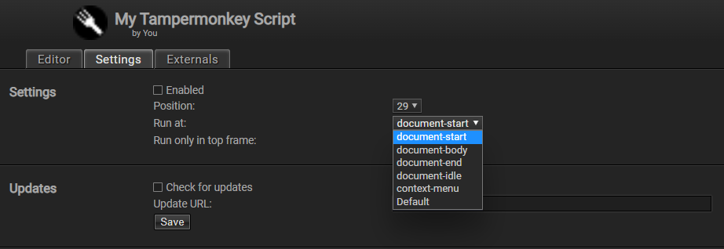

# Tampermonkey Script Killer

Tampermonkey helper scripts to make document's script tampering easier by mutating it on DOM mutation.

---
## Preparation

Create a tampermonkey script that require this helper script:
```js
// ==UserScript==
// @name         My Tampermonkey Script
// @namespace    http://tampermonkey.net/
// @version      0.1
// ...
// @require      https://cdn.jsdelivr.net/gh/inf-initely/tampermonkey-script-killer/dist/index.js
// ...
// ==/UserScript==
```

Then, change the script settings to run at `document-start`.



Class `Mutator` will be available to the script globally if the helper script loaded correctly (injected to `window`.)

----
## Usage

Let's say for example, we want to nuke an annoying timeout and just instantly execute a script.

First, we need to instantiate the `Mutator` class.
```js
const mutator = new Mutator()
```

Then, add a replace parameter:
```js
mutator.addReplace([
  new RegExp(`var interval = setInterval(function(){\s+document.getElementById('dem').innerHTML = i;.+i--;\s+}, 1000);`), ''
])
```

Observe the `documentElement`:
```js
mutator.observe(document.documentElement, { childList: true, subtree: true })
```

And watch the script got nuked as soon as it's being added to the DOM, from this:
```html
<script>
  var interval = setInterval(function(){
    document.getElementById('dem').innerHTML = i;
    
    jQuery('.circle_animation').css('stroke-dashoffset', initialOffset-(i*(initialOffset/time)));
    
    if (i <= 0){
      clearInterval(interval);
      Goroi_n_Create_Button("2iqX4qozpRDY0f+K+4lv+l1DGWVhfanhNT38sQEUc54qd0f9lnE6Zt3KqHU8ka4F5EtYG8qTXMy7ngPueUNZNH8L8fUPMT5qxy3oALbGYsRgGsceJ2zxHy/fYkx9MX35qN56JPDdAtC+fBo2WLH9M2vD+CTB/VRfMLFbicJSOISrhEBEuPU62vCD0xM7YOBvzNnw+l6z37Hry26YwkXZLvq6BKytsbvTMHsrI8UjmpbCUjlL0kjXjIeDo2y8u8r2JKJeEy");
    }
    i--;
  }, 1000);
</script>
```

to this:
```html
<script>

</script>
```

---
## API Documentation

To be added.